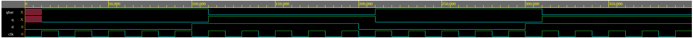
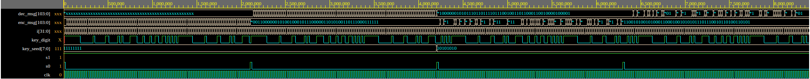

# Heading

- Name: Daniel Oliveira Nascimento
- Number: 2020054293
- Email: [on-daniel@ufmg.br](mailto:on-daniel@ufmg.br)

# Introduction

- This repository contains three folders. Inside each one, there is a project containing a design file, a testbench file and a time diagram screenshot. These projects are:
  - Behavioral D Flip Flop;
  - Structural D Flip Flop;
  - OTP Encoder/Decoder.

# D Flip Flop

## Introduction

- Based on a Positive Edge Triggered D Flip Flop.

## Structural

- Implemented by using 1 inverter, 2 AND gates and 2 NOR gates.

## Behavioral

- Implemented by turning Q equals D at the positive edges of the clock pulse.

## Testbench

- Both structural and behavioral codes use the same testbench file: changes D value four times to show how FF behaves when clock pulses.

## Time diagram analysis

- Both structural and behavioral diagrams are the same, as it expected once it implements the same FF and testbench files are equal.
- We can see that Q and Qbar starts as an invalid output.
- After the first positive edge of the clock, Q and Qbar get a valid value.
- After that, Q starts following D value at all the positive edges.

# OTP Encoder/Decoder
## LFSR

### Introduction

- An 8 bit LFSR was chosen because it has a small period, so it's easy to check if it's working correctly and it's quick to simulate.
- LFSR polynomial function is `x8 + x7 + 1` or `x1 + x2 + 1`, depending on the shifting direction.
- It was developed using the behavioral way as it is much simpler than the structural.
- Despite being an 8 bit LFSR, the code can be easily changed to another bit size as it was developed using local params.
- The strategy to combine its data is doing a xor between the two least significant bits when shifting right, or between the two most significant bits when shifting left.

### Parameters description

- `clk` (clock): LFSR just changes its state at positive edges of the clock.
- `clear`: when high, set all LFSR outputs to 1.
- `s0`, `s1`: control if LFSR will load a new input or shift its output.
- `in` (input): input to be loaded.
- `l_out` (left out): returned value after shifting left.
- `r_out` (right out): returned value after shifting right.
- `out`: full output.

### Parameters behave

- When `clear` is `1`, `out` goes to its max value, which is defined by a localparam.
- When `s0` and `s1` goes `1`, `in` value is loaded to the register.
- When `s0` goes `1` and `s1` goes `0`, LFSR shifst left.
- When `s0` goes `0` and `s1` goes `1`, LFSR shifst right.

### Localparams

- Localparams are being used to turn the code reusable. It's easy to change LFSR size through them.
  - **WARN:** `MAX` localparam must NOT be full of 0s, or it will get stuck at this value after clearing LFSR.

## Testbench

### Introduction

- Localparams are being used to make the code reusable. It's easy to change messages size through them.
  - **WARN:** note that both keys and both messages follows the predefined localparam sizes.
- All messages have the same size to keep the code simple.
- LFSR is instantiated to generate a pseudo random key to encode/decode messages.
- The clock period is `20ps`.
  - It is important to note that every state change is made based on this period, to ensure all changes will be commited.
- A couple of tasks were set up to keep the code clean and simple to understand.
  
### Tasks

- `set_epwave`: just set stuff to generate time diagrams.
- `set_clock`: just set initial value (`0`) to the clock.
- `generate_key`: given a seed, generate a key by changing LFSR `s0` and `s1` to load the seed as its input and then start shifting right.
  - Other strategies with this LFSR could be used here, such as shifting left instead of right; or clearing LFSR and then start shifting to right or left.
  - As this strategy was chosen, I've not used LFSR `clear`, `out` and `l_out` params in the testbench file.
- `encode`: once the key is already being generated, encode a given message by doing bitwise xor between the message and the key.
- `decode`: decode the message by doing bitwise xor between the encoded message and the key.
  - **WARN:** note that both `encode` and `decode` tasks are using one period of the clock between each bitwise xor operation. It's possible to change to whichever period, but they MUST BE equal.
  - **WARN:** `generate_key` must be called before each `encode` and `decode` to ensure all operations will use the same seed and the same generation.
- `show_result`: just print encoded and decode message.

### Testcases

- There are two testcases in the testbench file:
  - Encode and decode "Hello, World!" using seed 11111111.
  - Encode and decode "BH eh nóis!!" using seed 10101010.

### Time diagram analysis

- Clock pulses.
- `s0` goes `1` four times: two times to load the key seed to encode/decode the first message; and two times to do the same for the second message.
- `key_seed` is `11111111` during half period of the execution, as it is the period when the first message is being encoded/decoded. During the second half, it handles the second message key seed (`10101010`).
- `key_digit` is the pseudo random part of the code. It's easy to see that the random function is "pseudo" because it clearly repeats a pattern.
- `i` is a control variable used to help handling bitwise operations by going through each digit of the messages. So its time would be better analysed using a decimal radix, as it goes from `103` to `0` two times (one for each message).
  - `103 + 1` is the current size of each message.
- To get a general POV, we can split the diagram in four parts of the same size:
  - 1st part: we are encoding "Hello, World!", so `s0` and `s1` goes `1` and load the message. Then `s0` goes to `0` to start shifting right. At this point, `enc_message` starts to be constructed using `key_digit`, which is being generated from the first seed.
  - 2nd part: once again, `s0` and `s1` goes to `1` together, to reload the seed. This time, the seed will be used to contruct the decoded message. So we can see that the `key_digit` pattern is the equal than the first part and `enc_message` isn't being constructed anymore.
  - The 3rd and 4th parts follows the 1st and 2nd behave, but using a different seed and a different message.

# Running

- There are 3 programs, one in each folder. To run any of them, do these following steps: 
  - Copy/paste `design.sv` and `testbench.sv` on [EDA playground](https://www.edaplayground.com/).
  - Select `Icarus Verilog 0.9.7` on Tools & Simulators.
  - Check `Open EPWave after run` if you want to see the time diagram.
  - Check out the `Log` tab to see encoded and decode messages.

# Credits

- Made by [Daniel Oliveira Nascimento](https://ondaniel.com.br/) at UFMG.
- Follow and star:star: this project on [GitHub](https://github.com/ondanieldev/ufmg-isl).